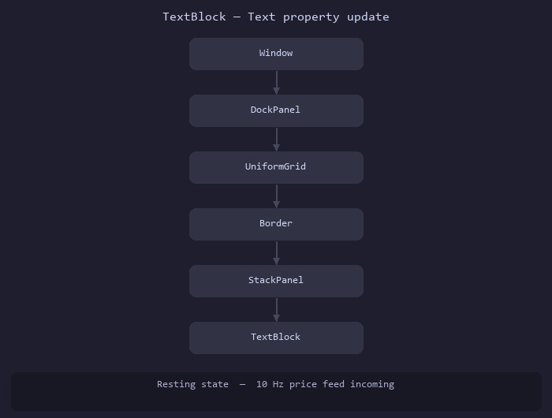
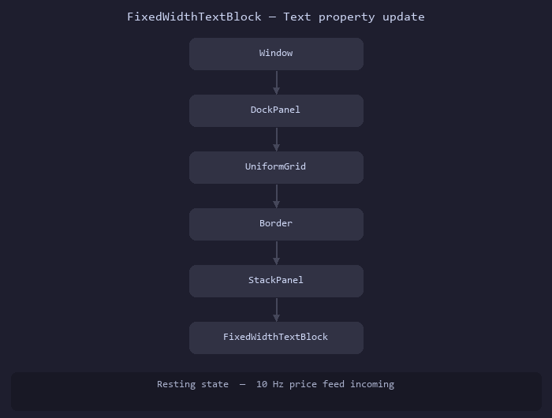

# WpfFastControls

A single WPF control that eliminates layout-pass overhead for high-frequency text displays.

## The Problem

Every time `TextBlock.Text` changes, WPF calls `InvalidateMeasure()` on the element. This propagates upward through the entire visual tree — panels, windows, and everything in between — triggering a full layout pass even though the text occupies exactly the same rectangle as before.

### What WPF's layout system does on `TextBlock.Text` change

```
TextBlock.Text = "1.23457"
  └─► InvalidateMeasure()          // TextBlock marks itself dirty
        └─► parent StackPanel      // propagates up…
              └─► parent Border
                    └─► parent UniformGrid
                          └─► parent Window
                                └─► layout pass walks back down the tree
```



## The Solution: `FixedWidthTextBlock`

`FixedWidthTextBlock` inherits from `FrameworkElement` and registers its `Text` dependency property with `AffectsRender` only — **not** `AffectsMeasure`.

A text change calls `InvalidateVisual()`, which queues a repaint of this element alone. The layout tree is never touched.

`MeasureOverride` returns either the caller-supplied `FixedWidth`/`FixedHeight` or the size measured on the **first** layout pass. After initial layout the element's size is frozen, so the layout system has nothing to recalculate.

```
FixedWidthTextBlock.Text = "1.23457"
  └─► InvalidateVisual()           // repaint this element only
        └─► OnRender()             // draw FormattedText — done
```



CPU impact in the original dashboard: **~7% → ~3%** for the render thread — a 4 percentage point reduction.

## Quick Start

Add a project reference (or NuGet reference when published):

```xml
<ProjectReference Include="path/to/WpfFastControls/WpfFastControls.csproj" />
```

Declare the namespace in your XAML:

```xml
xmlns:fast="clr-namespace:WpfFastControls.Controls;assembly=WpfFastControls"
```

Use the control:

```xml
<fast:FixedWidthTextBlock
    Text="{Binding BidPrice, Mode=OneWay, StringFormat={}{0:F5}}"
    FixedWidth="120"
    TextAlignment="Right"
    FontSize="28"
    FontWeight="SemiBold"
    Foreground="LightGreen" />
```

## TextBlock vs FixedWidthTextBlock — side by side

| | `TextBlock` | `FixedWidthTextBlock` |
|---|---|---|
| **Base class** | `Control` | `FrameworkElement` |
| **Text DP flags** | `AffectsMeasure \| AffectsRender` | `AffectsRender` only |
| **On text change** | `InvalidateMeasure()` → layout pass | `InvalidateVisual()` → repaint only |
| **Layout propagation** | Walks up the visual tree | Stops at this element |
| **MeasureOverride** | Measures text every call | Returns fixed size after first pass |
| **XAML usage** | `<TextBlock Text="..."/>` | `<fast:FixedWidthTextBlock Text="..." FixedWidth="120"/>` |
| **Wrapping / auto-width** | Yes | No — caller must supply `FixedWidth` |
| **Suitable for** | Any text | Fixed-format strings (prices, counters, timestamps) |

## Properties

| Property | Type | Default | Notes |
|---|---|---|---|
| `Text` | `string` | `""` | Triggers repaint only — no layout |
| `FixedWidth` | `double` | `NaN` | Lock element width; `NaN` = auto-measure on first pass |
| `FixedHeight` | `double` | `NaN` | Lock element height; `NaN` = auto-measure on first pass |
| `Foreground` | `Brush` | `Black` | Triggers repaint only |
| `FontSize` | `double` | `14` | Triggers re-measure (font change affects size) |
| `FontWeight` | `FontWeight` | `Normal` | Triggers re-measure |
| `FontFamily` | `FontFamily` | `Segoe UI` | Triggers re-measure |
| `TextAlignment` | `TextAlignment` | `Left` | `Left`, `Center`, `Right` — triggers repaint only |

## When to use / not use

**Use `FixedWidthTextBlock` when:**
- Text content is fixed-format (prices, counters, timestamps, status codes)
- The displayed string always fits within a known pixel width
- The element updates more than a few times per second

**Do not use when:**
- Text length is unpredictable and the element must auto-size horizontally
- You need text wrapping, inline runs, or hyperlinks

## Samples

Two identical-looking WPF windows in `samples/` demonstrate the difference:

| Project | Control | Behaviour |
|---|---|---|
| `Sample.WithTextBlock` | `TextBlock` | Standard WPF — layout pass on every tick |
| `Sample.WithFixedWidthTextBlock` | `FixedWidthTextBlock` | Render-only — no layout pass |

Both display 12 simulated FX price tiles updating at **10 Hz**. Run each under a profiler (Visual Studio Diagnostic Tools → CPU Usage, or JetBrains dotTrace) and compare the time spent in `UIElement.Measure` / `UIElement.Arrange`.

### Build & run

```bash
# From the WpfFastControls/ root
dotnet build WpfFastControls.slnx

dotnet run --project samples/Sample.WithTextBlock
dotnet run --project samples/Sample.WithFixedWidthTextBlock
```

## Performance Results

When measured on a 12-tile FX pricing dashboard updating at 10 Hz.  
Profiler: Visual Studio → Debug → Performance Profiler → CPU Usage.

The CPU usage improves by 2 to 4% points. 

Look for time in:
- `System.Windows.UIElement.Measure` — near-zero for `FixedWidthTextBlock`
- `System.Windows.UIElement.Arrange`
- `System.Windows.Media.MediaContext.RenderMessageHandler`

## Implementation notes

`FormattedText` is rebuilt in `OnTextChanged` (called before `InvalidateVisual`) so that `OnRender` itself makes zero heap allocations per frame — it simply calls `DrawingContext.DrawText` with the pre-built object.

`_pixelsPerDip` is captured once from `VisualTreeHelper.GetDpi()` on first use to produce DPI-aware text without per-frame overhead.

Font properties (`FontSize`, `FontWeight`, `FontFamily`) correctly trigger `AffectsMeasure` because a font change genuinely alters the element's desired size.

## License

MIT
